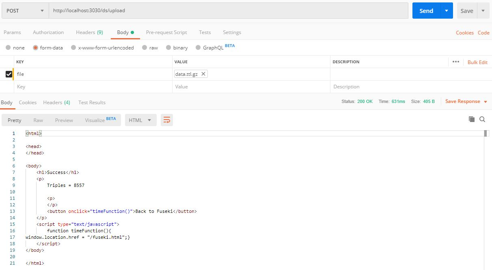
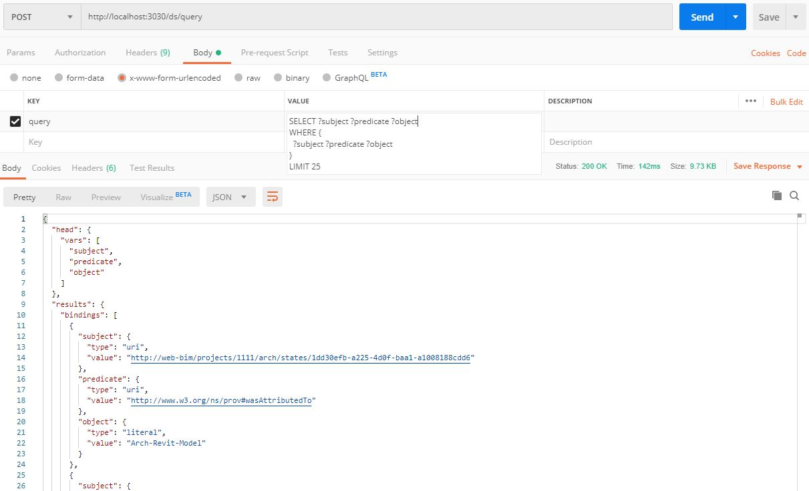
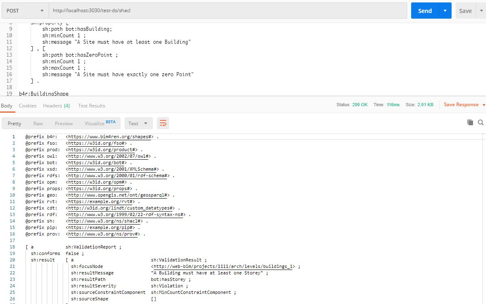
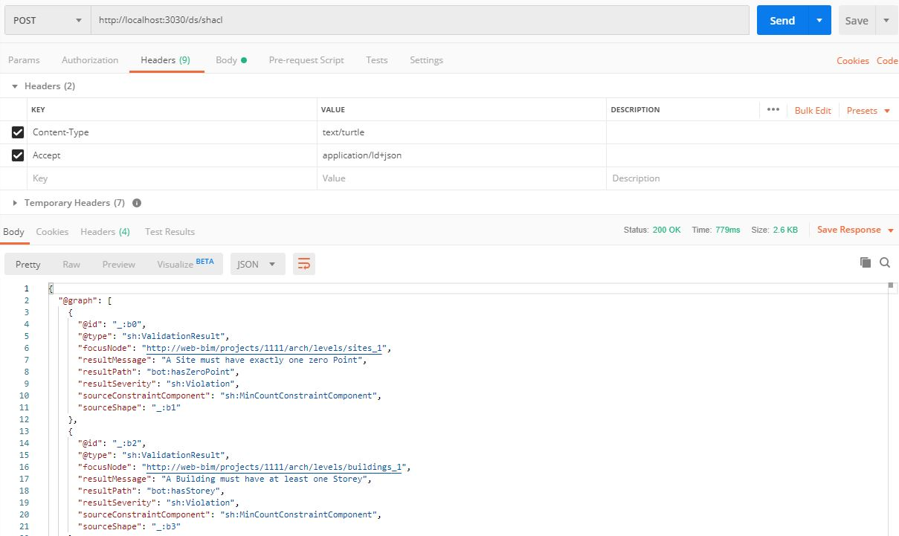

# SHACL TESTPROJEKT

# Generering af LBD-fil
Brug Jyrkis [IFTtoLBD converter](https://github.com/jyrkioraskari/IFCtoLBD) til at konvertere en vilkårlig IFC-fil til LBD triples. Det nemmeste er blot at hente filen [IFCtoLBD_Desktop_Java8-1.81.jar](https://github.com/jyrkioraskari/IFCtoLBD/raw/master/IFCtoLBD_Desktop_Java8-1.81.jar) og bruge den grafiske brugerflade.

Brug indstillinger som vist herunder:


Alternativt kan du bruge filen *Duplex.ttl* som er indeholdt i dette repo.

# Opsætning
Kræver docker

1. Klon dette projekt

2. Kør kommando docker-compose up
    - Starter en Fuseki version 3.14.0 med den konfiguration der ligger i mappen jena-docker (modificeret stain/docker)
    - Opretter et in-momory datasæt med den konfiguration der er defineret i `test-ds-in-mem.ttl`

3. Send POST request til (http://localhost:3030/ds/upload)[http://localhost:3030/ds/upload] med ttl-filen (eksempelvis *Duplex.ttl*). Herunder er det vist hvordan det gøres i programmet [Postman](https://www.getpostman.com/)


4. Send POST request til (http://localhost:3030/ds/query)[http://localhost:3030/ds/query] med form data query =
```
SELECT ?subject ?predicate ?object
WHERE {
  ?subject ?predicate ?object
}
LIMIT 25
```


5. Send POST request til (http://localhost:3030/ds/shacl)[http://localhost:3030/ds/shacl] med indholdet af en af SHACL-reglerne i mappen */rules* i body og `Content-Type`-header = `text/turtle`. Bemærk at der kan være forskel på hvad egenskaber kaldes - det dur selvfølgelig ikke hvis regelgranskning skal automatiseres. Bemærk desuden at modeller bruger forskellige enheder. I udgangspunktet bør længder være i mm og arealer i m2, men med systemer som [CDT](https://ci.mines-stetienne.fr/lindt/playground.html?example=area) kan omregningen automatiseres som en del af regelen.

Resultatet kan også returneres i JSON-LD
